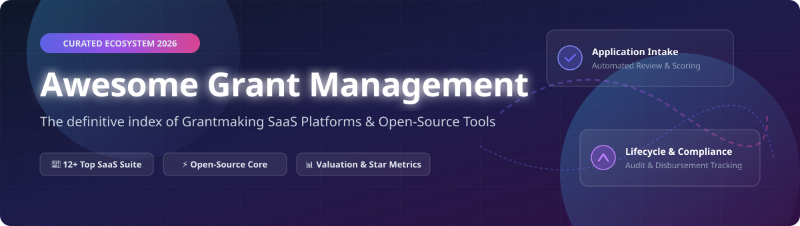

# 🏛️ Awesome Grant Management Software & Open-Source Ecosystem 🎓

<a href="https://github.com/ishandutta2007/Awesome-Awesome-Awesome"></a><a href="https://discord.gg/jc4xtF58Ve"></a> <a href="https://github.com/ishandutta2007"></a>



## 📌 Top Grant Management Platforms & Software Ecosystem

**Curated List of SaaS Products & Open-Source GitHub Projects** 🚀

*Focused on Grantmaking, Application Intake, Review Workflows, Compliance, Reporting & Funder/Recipient Lifecycle Management*

**Last updated: September 2026** 📅

---

### 🔍 Overview & Ecosystem Analysis

This repository tracks notable **SaaS platforms** and **open-source projects** for **Grant Management Software**. These enterprise systems help grantmakers, private foundations, public sector agencies, higher education research institutions, and non-profit grantseekers manage the complete grant lifecycle—from opportunity discovery and application intake through review workflows, award disbursements, compliance auditing, reporting, and closeout.

💡 **Open-Source vs Commercial Landscape**: Full-featured grant management platforms are predominantly commercial SaaS products due to strict compliance, auditing, and multi-stage review workflows required by large funders. Practical open-source options include **CiviCRM** (with funding extensions), **ERPNext / Odoo** funding modules, low-code form builders (**Form.io**, **Appsmith**, **Directus**, **ToolJet**, **NocoDB**, **Budibase**), and open intake tools like **KoboToolbox**.

---

## 📑 Table of Contents

- [📊 Sector & Market Analysis](#-sector--market-analysis)
- [💼 SaaS & Commercial Platforms](#-saas--commercial-platforms)
- [⚡ Open-Source GitHub Projects](#-open-source-github-projects)
- [🏗️ Architectural Blueprint for Open Systems](#%EF%B8%8F-architectural-blueprint-for-open-systems)
- [🤝 How to Contribute](#-how-to-contribute)
- [💖 Support & Sponsorship](#-support--sponsorship)
- [📈 Star History](#-star-history)
- [⚠️ Disclaimer](#%EF%B8%8F-disclaimer)

---

## 📊 Sector & Market Analysis

> 📈 **Estimated Global Market Size**: The global Grant Management Software market size is estimated at **$1.8 Billion - $2.4 Billion (2025/2026)** and is projected to expand at a compound annual growth rate (CAGR) of 10.5%–12% through 2030, driven by digital transformation in philanthropy, public-sector funding accountability, and automated compliance.
>
> 🧩 **Market Structure**: The sector is **moderately fragmented**, with key public enterprise providers like **Blackbaud** ($2.0B market cap) leading higher-education and large nonprofit suites, alongside high-growth private equity-backed platforms (**Submittable**, **Foundant**, **Fluxx**, **SmartSimple**, **AmpliFund**) capturing specialized verticals (foundations, government agencies, competitive scholarship programs).

---

## 💼 SaaS & Commercial Platforms

*Table sorted descending by company size (Valuation / Revenue / Market Capitalization).*

| Platform 🌐 | Description 📝 | Valuation / Revenue / Company Size 🏢 | Starting Pricing Tier 💵 | Free Tier / Trial Limits ⏳ |
| :--- | :--- | :--- | :--- | :--- |
| **[Blackbaud Grantmaking](https://www.blackbaud.com/)** | Enterprise grantmaking suite integrated with fundraising, CRM, and donor systems for large institutions. | **$2.0 Billion Market Cap** (~$1.15 Billion Annual Revenue) | **$5,000 / year** (quote-based enterprise contract) | **No Free Tier** (Demo available on request) |
| **[Submittable](https://www.submittable.com/)** | Intuit/PE-backed social-impact & grant intake platform widely used for grants, awards, and corporate giving. | **$300 Million+ Valuation** (~$40M–$60M Annual Revenue) | **$3,000 / year** (plus submission-based volume add-ons) | **14-Day Free Trial** (full feature access, no credit card required) |
| **[Fluxx](https://www.fluxx.io/)** | Enterprise grantmaking platform used by major global foundations for complex multi-stage workflows. | **$150 Million–$250 Million Valuation** (~$30M–$50M Revenue) | **$39.99 / month** (*Fluxx Grantseeker*); Enterprise Grantmaker starts at **$10,000+/year** | **14-Day Free Trial** for *Grantseeker*; Demo required for Enterprise |
| **[Foundant GrantHub / GLM](https://www.foundant.com/)** | Comprehensive grant lifecycle & foundation management suite for funders and community foundations. | **$100 Million–$200 Million Valuation** (~$25M–$40M Revenue) | **$4,250 / year** (annual/two-year contract commitment) | **14-Day Free Trial** (GrantHub seeker side); GLM demo on request |
| **[SmartSimple](https://www.smartsimple.com/)** | Highly configurable enterprise platform for grantmaking, research administration, and complex funding programs. | **$80 Million–$150 Million Valuation** (~$20M–$35M Revenue) | **$5,000 / year** (custom enterprise program tier) | **No Free Tier** (Guided sandbox demo environment provided upon inquiry) |
| **[AmpliFund / Euna Grants](https://www.amplifund.com/)** | Specialized public sector grant management software built for state, local government, and federal funding compliance. | **$50 Million–$100 Million Valuation** (~$15M–$25M Revenue) | **$6,000 / year** (public sector program subscription) | **No Free Tier** (Public sector trial sandbox available via sales representative) |
| **[Instrumentl](https://www.instrumentl.com/)** | Institutional grant discovery, application tracking, and grantseeking workflow platform for nonprofits. | **$40 Million–$80 Million Valuation** (~$10M–$20M Revenue) | **$179 / month** (billed annually for Basic Plan) | **14-Day Free Trial** (unlimited grant searches, no credit card required) |
| **[Good Grants](https://www.goodgrants.com/)** | Global award and grant management software supporting applicant intake, reviewer scoring, and administration. | **$20 Million–$50 Million Valuation** (~$5M–$12M Revenue) | **$7,900 / year** (~$658/month billed annually) | **14-Day Free Trial** (full portal access for administrative testing) |
| **[OpenWater](https://www.getopenwater.com/)** | Awards, grants, and abstract management software designed for competitive scoring and conference reviews. | **$20 Million–$40 Million Valuation** (~$5M–$10M Revenue) | **$5,000 / year** (standard application portal tier) | **No Free Tier** (Interactive 14-day administrative preview upon request) |
| **[SurveyMonkey Apply](https://www.surveymonkey.com/product/apply/)** | Application and review workflow platform (part of Momentive AI / SurveyMonkey product family). | **$20 Million–$40 Million Product Line** (Parent ~$450M Revenue) | **$3,500 / year** (base application program tier) | **No Free Tier** (Request-based trial sandbox) |
| **[Optimy](https://www.optimy.com/)** | Corporate social responsibility (CSR), sponsorship, and grant management software for funding outcomes. | **$15 Million–$30 Million Valuation** (~$4M–$8M Revenue) | **$4,500 / year** (CSR & grant module package) | **No Free Tier** (Custom demo portal environment) |

---

## ⚡ Open-Source GitHub Projects

*Table sorted descending by GitHub stargazers count.* 🌟

| Project & Repo Link 🔗 | GitHub_Stars ⭐ | License 📜 | Description 📝 |
| :--- | :--- | :--- | :--- |
| **[Supabase](https://github.com/supabase/supabase)** | [](https://github.com/supabase/supabase/stargazers) | Apache-2.0 | Open-source Firebase alternative providing PostgreSQL, Auth, and Storage for custom grant data backends. |
| **[NocoDB](https://github.com/nocodb/nocodb)** | [](https://github.com/nocodb/nocodb/stargazers) | AGPL-3.0 | Open-source Airtable alternative turning grant databases into smart spreadsheets with intake forms. |
| **[Odoo](https://github.com/odoo/odoo)** | [](https://github.com/odoo/odoo/stargazers) | LGPL-3.0 | Open ERP suite with customizable project, budget allocation, grant disbursement, and reporting modules. |
| **[ToolJet](https://github.com/tooljet/tooljet)** | [](https://github.com/tooljet/tooljet/stargazers) | AGPL-3.0 | Low-code framework for building internal grant reviewer dashboards, scoring tools, and admin panels. |
| **[Appsmith](https://github.com/appsmithorg/appsmith)** | [](https://github.com/appsmithorg/appsmith/stargazers) | Apache-2.0 | Open-source low-code platform to quickly build custom grant application review portals and workflows. |
| **[ERPNext](https://github.com/frappe/erpnext)** | [](https://github.com/frappe/erpnext/stargazers) | GPL-3.0 | Full open-source ERP framework configurable for non-profit grant accounting, project budgets, and milestones. |
| **[Directus](https://github.com/directus/directus)** | [](https://github.com/directus/directus/stargazers) | BSL-1.1 | Open Data Platform converting SQL databases into dynamic REST/GraphQL APIs and grant admin portals. |
| **[Budibase](https://github.com/Budibase/budibase)** | [](https://github.com/Budibase/budibase/stargazers) | GPL-3.0 | Low-code platform for building grant application forms, approval queues, and internal review portals. |
| **[Form.io (JS Engine)](https://github.com/formio/formio.js)** | [](https://github.com/formio/formio.js/stargazers) | MIT | Advanced form rendering engine used to build complex, multi-page grant application intake webforms. |
| **[CiviCRM Core](https://github.com/civicrm/civicrm-core)** | [](https://github.com/civicrm/civicrm-core/stargazers) | AGPL-3.0 | Open-source constituent relationship management (CRM) for nonprofits, extensible for grant tracking. |
| **[KoboToolbox KPI](https://github.com/kobotoolbox/kpi)** | [](https://github.com/kobotoolbox/kpi/stargazers) | BSD-2-Clause | Humanitarian and nonprofit field data collection platform for grant impact monitoring and field reporting. |

---

## 🏗️ Architectural Blueprint for Open Systems

For organizations seeking an open-source grant management stack:

```
┌─────────────────────────┐      ┌─────────────────────────┐      ┌─────────────────────────┐
│  Application Intake     │ ───► │  Review & Case Mgmt     │ ───► │  Disbursement & ERP     │
│  (Form.io / Kobo /      │      │  (Appsmith / ToolJet /  │      │  (ERPNext / Odoo /      │
│   Budibase / NocoDB)    │      │   CiviCRM Core)         │      │   CiviCRM Funding)      │
└─────────────────────────┘      └─────────────────────────┘      └─────────────────────────┘
```

1. **Intake & Portal**: Capture multi-page grant applications with attachments via **Form.io** or **Budibase**.
2. **Review & Scoring Workflow**: Route submissions through multi-tier review matrices built using **Appsmith** or **ToolJet**.
3. **Grantee & Contact CRM**: Maintain applicant records, organization relationships, and historical awards in **CiviCRM**.
4. **Post-Award & Financial Audit**: Track milestone deliverables, financial disbursements, and compliance metrics in **ERPNext**.

---

## 🤝 How to Contribute

Contributions are warmly welcomed! Help keep this repository comprehensive and accurate:

1. Fork this repository 🍴
2. Create a feature branch (`git checkout -b feature/add-grant-tool`) 🌿
3. Update `README.md` keeping formatting consistent ✍️
4. Open a Pull Request with details on why the resource should be added 🚀

---

## 💖 Support & Sponsorship

If you find this curated grant management ecosystem list helpful, please consider supporting the project! ⭐

- **Star this repository** to improve discoverability for civic technologists and nonprofit grantmakers.
- **Share this repo** on Twitter/X, LinkedIn, or tech communities.
- **Sponsor the Maintainer**: Support ongoing open-source curation and development via GitHub Sponsors!

[](https://github.com/sponsors/ishandutta2007)

---

## 📈 Star History

[](https://star-history.dera.page/#ishandutta2007/Awesome-Grant-Management&type=date&legend=top-left)

---

## ⚠️ Disclaimer

- This list is **community-curated** for informational and educational purposes only—it does not constitute financial, legal, or procurement advice.
- Pricing details, free trial availability, and market valuations are estimated as of late 2026 based on public disclosures and industry benchmark reports. Contact individual SaaS vendors directly for formal software proposals.
